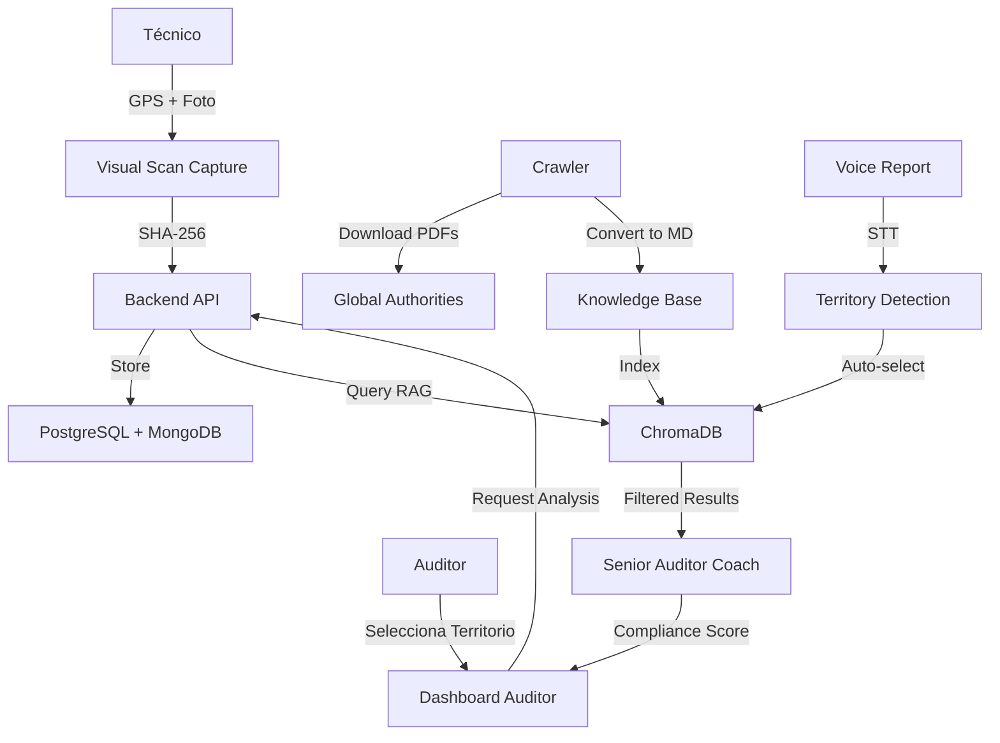

# Sistema "Cielos Abiertos" - Documentación Técnica

## 🌍 Visión Global Regulatory Intelligence

OnTrackIA se convierte en la **autoridad mundial de consulta normativa aeronáutica** con cobertura de 13 jurisdicciones y filtrado territorial inteligente.

---

## 📊 Arquitectura del Sistema



---

## 🗄️ ChromaDB Metadata Schema

### Document Metadata Structure

```json
{
    "source_file": "/knowledge_base/global/BRAZIL/ANAC_rbac145_1a2b3c4d.md",
    "file_name": "ANAC_rbac145_1a2b3c4d.md",
    "category": "EASA_REGULATION",
    "category_label": "Regulación EASA",
    "chunk_index": 0,
    "total_chunks": 15,
    "file_hash": "a3f5d8e9c2b1...",
    "indexed_at": "2026-02-04T12:00:00Z",
    
    // CIELOS ABIERTOS METADATA
    "territory": "BRAZIL",
    "authority": "Agência Nacional de Aviação Civil",
    "abbreviation": "ANAC",
    "document_type": "RBAC 145"
}
```

### Territory Codes

| Code | Country | Authority |
|------|---------|-----------|
| `AUSTRALIA` | 🇦🇺 Australia | CASA |
| `BRAZIL` | 🇧🇷 Brasil | ANAC |
| `CANADA` | 🇨🇦 Canadá | TCCA |
| `CHILE` | 🇨🇱 Chile | DGAC |
| `CHINA` | 🇨🇳 China | CAAC |
| `COSTA_RICA` | 🇨🇷 Costa Rica | DGAC |
| `ECUADOR` | 🇪🇨 Ecuador | DGAC |
| `KENYA` | 🇰🇪 Kenia | KCAA |
| `MALTA` | 🇲🇹 Malta | TM CAD |
| `MEXICO` | 🇲🇽 México | AFAC |
| `QATAR` | 🇶🇦 Qatar | QCAA |
| `SOUTH_AFRICA` | 🇿🇦 Sudáfrica | SACAA |
| `SWITZERLAND` | 🇨🇭 Suiza | FOCA |
| `UK` | 🇬🇧 Reino Unido | UK CAA |
| `GLOBAL` | 🌍 Global | All |

---

## 🔄 RAG Query Flow

### 1. Sin Filtro Territorial (GLOBAL)

```python
# Query amplia
results = collection.query(
    query_texts=["OJT supervisor signature requirements"],
    n_results=20
)

# Re-ranking por categoría
sorted_results.sort(key=lambda x: (
    x[1].get('category') in ['EASA_REGULATION', 'FAA_REGULATION', ...],
    -x[2]  # distancia
), reverse=True)

# Top 10 resultados multi-jurisdicción
```

### 2. Con Filtro Territorial (BRAZIL)

```python
# Query amplia
results = collection.query(
    query_texts=["OJT supervisor signature requirements"],
    n_results=20
)

# Re-ranking 3-nivel con prioridad territorial
sorted_results.sort(key=lambda x: (
    x[1].get('territory') == 'BRAZIL',          # ⭐ Match territorial exacto
    x[1].get('category') in relevant_categories, # Categoría regulatoria
    -x[2]                                        # Menor distancia
), reverse=True)

# Top 10: ANAC/RBAC prioritarios
```

---

## 🎤 STT Territory Detection

### Keyword Mapping

```python
territory_keywords = {
    # Brasil
    'brasil': 'BRAZIL',
    'brazil': 'BRAZIL',
    'anac': 'BRAZIL',
    'rbac': 'BRAZIL',
    
    # Canadá
    'canadá': 'CANADA',
    'canada': 'CANADA',
    'tcca': 'CANADA',
    'transport canada':  'CANADA',
    'car 573': 'CANADA',
    
    # Y 11 territorios más...
}
```

### Ejemplo de Detección

```
Input Voice: "Operando en Brasil, conforme a RBAC 145, detecté fisura"
                    ↓
STT Transcription: "operando en brasil conforme a rbac 145 detecté fisura"
                    ↓
Territory Detection: keyword='brasil' → BRAZIL
                    ↓
Discrepancy Detection: keyword='fisura' → criticality=medium
                    ↓
Output: {
    "transcription": "...",
    "territory": "BRAZIL",
    "discrepancies_found": ["fisura"],
    "criticality": "medium"
}
```

---

## 📥 Regulatory Crawler

### Supported Authorities

```python
AUTHORITIES = {
    'BRAZIL': {
        'name': 'ANAC - Agência Nacional de Aviação Civil',
        'abbreviation': 'ANAC',
        'urls': {
            'rbac145': 'https://www.anac.gov.br/.../rbac/rbac-145',
            'sgso': 'https://www.anac.gov.br/.../sgso'
        },
        'keywords': ['RBAC 145', 'RBAC 66', 'SGSO']
    },
    'CANADA': {
        'name': 'TCCA - Transport Canada Civil Aviation',
        'abbreviation': 'TCCA',
        'urls': {
            'car': 'https://tc.canada.ca/.../cars',
            'sms': 'https://tc.canada.ca/.../sms'
        },
        'keywords': ['CAR 573', 'AMO', 'SMS']
    },
    // ... 11 territorios más
}
```

### Download & Conversion Pipeline

```
PDF URL
  ↓
Download (requests)
  ↓
Parse (pdfplumber o PyPDF2 fallback)
  ↓
Convert to Markdown
  ↓
Add YAML Frontmatter:
---
territory: BRAZIL
authority: ANAC
abbreviation: ANAC
document_type: RBAC 145
source_url: https://...
crawled_at: 2026-02-04T12:00:00Z
---
  ↓
Save: /knowledge_base/global/BRAZIL/ANAC_rbac145_abc123.md
```

---

## 🧠 Senior Auditor Coach Scoring

### Compliance Algorithm

```python
def calculate_compliance(rag_results, context):
    score = 100.0
    
    # Criterios obligatorios
    if not context.get('has_supervisor_signature'):
        score -= 15  # RBAC 66 / Part-66 requirement
    
    if not context.get('has_gps_evidence'):
        score -= 20  # OnTrackIA forensic policy
    
    if not context.get('has_timestamp_valid'):
        score -= 25  # Temporal integrity
    
    if not context.get('has_photo_evidence'):
        score -= 30  # Visual evidence mandatory
    
    # RAG confidence
    rag_confidence = rag_results.get('confidence', 0.75)
    if rag_confidence < 0.7:
        score -= 10  # Low normative match
    
    # Bonus
    if context.get('has_voice_report'):
        score += 5
    
    return max(0, min(100, score))
```

### Risk Classification

```python
def classify_risk(compliance_score):
    if compliance_score >= 85:
        return "green"   # ✅ Aprobado
    elif compliance_score >= 60:
        return "yellow"  # ⚠️ Revisión requerida
    else:
        return "red"     # ❌ No cumple
```

---

## 🔐 Forensic Integrity

### SHA-256 Hashing

```python
def calculate_file_hash(file_path):
    sha256 = hashlib.sha256()
    with open(file_path, 'rb') as f:
        for block in iter(lambda: f.read(4096), b''):
            sha256.update(block)
    return sha256.hexdigest()

# Ejemplo:
# File: visual_scan_1738665015.webp
# Hash: a3f5d8e9c2b14f7e8d6c5a4b3c2d1e0f...
```

### Metadata Verification

```json
{
    "server_hash": "a3f5d8e9...",      // SHA-256 calculado en servidor
    "capture_timestamp": "2026-02-04T10:30:15.123Z",
    "gps_latitude": 40.416775,
    "gps_longitude": -3.703790,
    "device_info": {
        "model": "iPhone 14 Pro",
        "os": "iOS 17.2"
    }
}
```

---

## 📡 API Request/Response Examples

### POST /api/v2/audit/analyze (Con Territorio)

**Request:**

```json
{
    "evidence_id": "scan_1738665015",
    "task_description": "Inspección visual tren de aterrizaje",
    "territory": "BRAZIL",
    "context": {
        "aircraft_type": "B737-800",
        "component": "Landing Gear",
        "task_code": "32-31-00",
        "has_supervisor_signature": false,
        "has_gps_evidence": true,
        "has_timestamp_valid": true,
        "has_photo_evidence": true
    }
}
```

**Response:**

```json
{
    "success": true,
    "evidence_id": "scan_1738665015",
    "timestamp": "2026-02-04T12:45:30.123Z",
    "primary_agent": "senior_auditor",
    
    "compliance_score": 85.0,
    "risk_level": "green",
    "territory": "BRAZIL",
    
    "normative_references": [
        {
            "authority": "ANAC",
            "document": "RBAC_145_subparte_c.md",
            "section": "Chunk 3/15",
            "relevance": 0.94,
            "criticality": "high"
        },
        {
            "authority": "ANAC",
            "document": "RBAC_66_apendice_i.md",
            "section": "Chunk 1/8",
            "relevance": 0.89,
            "criticality": "high"
        }
    ],
    
    "discrepancies": [
        {
            "severity": "medium",
            "regulation": "RBAC 66 Apêndice I",
            "description": "Task requires supervisor signature",
            "recommendation": "Add supervisor digital signature before final validation"
        }
    ],
    
    "rag_insights": "High confidence analysis for BRAZIL jurisdiction based on 5 regulatory references...",
    
    "processing_time_ms": 1850
}
```

---

## 🚀 Deployment Checklist

### Pre-Deployment

- [ ] Git pull latest code
- [ ] Install dependencies: `pip install -r requirements.txt`
- [ ] Create knowledge base dir: `mkdir -p ./knowledge_base/global`
- [ ] Create ChromaDB dir: `mkdir -p ./data/chromadb`

### Crawl & Index

```bash
# 1. Crawl all territories (2-4 hours)
python3 scripts/regulatory_crawler.py --all --output ./knowledge_base/global

# 2. Index ChromaDB (10-20 minutes)
python3 scripts/rag_indexer.py \
    --source ./knowledge_base/global \
    --chromadb-path ./data/chromadb \
    --clear  # Solo primera vez

# 3. Test query
python3 scripts/rag_indexer.py \
    --source ./knowledge_base/global \
    --test-query "RBAC 145 maintenance organization approval"
```

### Server Restart

```bash
# Kill old process
pkill -f "python.*server.py"

# Start in background
nohup python3 server.py > server.log 2>&1 &
echo $! > server.pid

# Verify
tail -f server.log
```

### Validation

```bash
# Test territorial query
curl -X POST http://localhost:8000/api/v2/audit/analyze \
    -H "Content-Type: application/json" \
    -d '{
        "evidence_id": "test",
        "task_description": "OJT record signature",
        "territory": "BRAZIL",
        "context": {}
    }' | jq .
```

---

## 📈 Monitoring

### ChromaDB Stats

```python
import chromadb
from chromadb.config import Settings

client = chromadb.Client(Settings(
    chroma_db_impl="duckdb+parquet",
    persist_directory="./data/chromadb"
))

collection = client.get_collection("ontrackia_knowledge")
print(f"Total documents: {collection.count()}")

# Query by territory
results = collection.get(
    where={"territory": "BRAZIL"},
    limit=10
)
print(f"BRAZIL docs: {len(results['ids'])}")
```

### Server Logs

```bash
# Monitor real-time
tail -f server.log

# Check errors
grep ERROR server.log

# Check RAG queries
grep "RAG query" server.log
```

---

## 🔮 Roadmap

### Q1 2026

- [x] Sistema Cielos Abiertos (13 territorios)
- [x] RAG territorial filtering
- [x] STT territory detection
- [ ] Crawl masivo completo

### Q2 2026

- [ ] Agentes adicionales: Visual Inspector, Risk Assessor
- [ ] Offline PWA sync completo
- [ ] Mobile app nativa

### Q3 2026

- [ ] Expansión a 20+ territorios
- [ ] Integración AMOS ERP
- [ ] Dashboard analytics avanzados

---

**OnTrackIA V2.0** - *El Cerebro Tridente piensa globalmente, actúa localmente* 🧠🌍✈️
