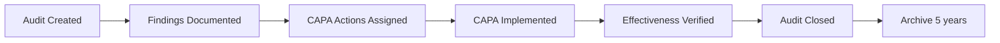

# OnTrackIA OJT V2.0 - Technical Dossier

## Aviation Compliance & Forensic Intelligence Platform

**Document Version**: 2.0  
**Date**: February 4, 2026  
**Classification**: Technical Documentation  
**Compliance**: EASA Part-145.A.55, AI Act Art. 14

---

## Executive Summary

OnTrackIA OJT V2.0 is an aeronautical compliance platform that combines forensic data architecture, regulatory intelligence (RAG), and AI-powered supervision to ensure total traceability and regulatory adherence in aviation maintenance training and auditing.

### Core Capabilities

- **Forensic Integrity**: SHA-256 sealing of all critical transactions
- **Regulatory Intelligence**: RAG system with 865+ aviation regulations
- **AI Governance**: Senior Auditor Coach with human-in-the-loop
- **Zero Insurrections**: Immutable audit trail with 5-year retention
- **Global Surveillance**: Automated monitoring of EASA, FAA, CAA, ICAO updates

---

## 1. System Architecture (The Bunker)

### 1.1 Technology Stack

| Layer | Technology | Purpose |
|-------|-----------|---------|
| **Backend API** | FastAPI 0.115.0 | High-performance async API |
| **Database** | PostgreSQL 16 | ACID-compliant relational DB |
| **Caching** | Redis 7.x | Session management & rate limiting |
| **Vector DB** | ChromaDB | RAG embeddings storage |
| **Container** | Docker 24.x | Isolated deployment environment |
| **Web Server** | Nginx | Reverse proxy & static serving |
| **Frontend** | React 18 + Vite | Progressive Web App (PWA) |

**Reference**: [`docker-compose.yml`](file:///Users/gregorioromerovega/Desktop/OnTrackIA_OJT/docker-compose.yml)

### 1.2 Security Perimeter

#### Access Control Matrix

Based on `roles_permissions.sql`:

| Role | Access Level | Key Permissions |
|------|-------------|----------------|
| **Super Admin** | Full System | All modules, user management, system config |
| **Company Admin** | Company Scope | Users, OJT, Audits, SMS within company |
| **Instructor** | Training Scope | OJT management, student supervision |
| **Auditor** | Audit Scope | Create findings, CAPA, read-only access |
| **Technician** | Execution | Task validation, photo upload, voice reports |
| **Student** | Limited | View assigned tasks, upload evidence |

**Hierarchical Control**:

- **Individual Plan**: Personal OJT progress
- **Corporate Plan**: Company-wide compliance oversight

**Reference**: [`backend/database/roles_permissions.sql`](file:///Users/gregorioromerovega/Desktop/OnTrackIA_OJT/backend/database/roles_permissions.sql)

#### Authentication Protocol (Bunker)

```python
# JWT-based authentication
JWT_ALGORITHM = "HS256"
SESSION_TIMEOUT = 3600  # 1 hour
REFRESH_TOKEN_LIFETIME = 604800  # 7 days

# Rate limiting
LOGIN_ATTEMPTS_MAX = 5
LOCKOUT_DURATION = 3600  # 1 hour

# Password policy
MIN_LENGTH = 12
REQUIRE_UPPERCASE = True
REQUIRE_LOWERCASE = True
REQUIRE_DIGITS = True
REQUIRE_SPECIAL = True
```

**SSH Hardening**:

- Password authentication: **DISABLED**
- Public key only: Ed25519
- Fail2Ban: 3 attempts → 1h ban
- Firewall: UFW restrictive (22, 80, 443, 8000)

**Reference**: [`scripts/server_setup.sh`](file:///Users/gregorioromerovega/Desktop/OnTrackIA_OJT/scripts/server_setup.sh)

---

## 2. Data Infrastructure & Forensics

### 2.1 Data Model

Core schema defined in [`init.sql`](file:///Users/gregorioromerovega/Desktop/OnTrackIA_OJT/backend/database/init.sql):

```
Audit → Finding → CAPA
  ↓        ↓        ↓
Audit Archive (Immutable)
```

#### Audit Lifecycle



**Critical Tables**:

| Table | Purpose | Retention |
|-------|---------|-----------|
| `audits` | Audit sessions | 5 years |
| `audit_findings` | Documented discrepancies | 5 years |
| `capa_actions` | Corrective/Preventive Actions | 5 years |
| `audit_archive` | Immutable historical record | Permanent |
| `ojt_person_tasks` | Training evidence | 5 years |

### 2.2 Compliance Triggers

Automated enforcement via [`compliance_triggers.sql`](file:///Users/gregorioromerovega/Desktop/OnTrackIA_OJT/backend/database/compliance_triggers.sql):

#### Trigger 1: Immutability Enforcement

```sql
CREATE TRIGGER prevent_audit_modification
BEFORE UPDATE ON audits
FOR EACH ROW
WHEN (OLD.status = 'closed')
EXECUTE FUNCTION reject_closed_audit_changes();
```

Prevents modification of closed audits (EASA Part-145.A.55 requirement).

#### Trigger 2: Automatic Archiving

```sql
CREATE TRIGGER auto_archive_audit
AFTER UPDATE ON audits
FOR EACH ROW
WHEN (NEW.status = 'closed' AND OLD.status != 'closed')
EXECUTE FUNCTION archive_audit();
```

Automatically archives audits to `audit_archive` upon closure.

#### Trigger 3: SHA-256 Sealing

```sql
CREATE TRIGGER seal_critical_task
BEFORE UPDATE ON ojt_person_tasks
FOR EACH ROW
WHEN (NEW.validation_status = 'validated')
EXECUTE FUNCTION generate_forensic_seal();
```

Generates SHA-256 seal for validated OJT tasks with:

- Task data
- Validator signature
- GPS coordinates
- Timestamp
- Device fingerprint

**Compliance**: Ensures 5-year retention and immutability per EASA Part-145.A.55(d).

---

## 3. Aeronautical Intelligence (RAG & AI)

### 3.1 Knowledge Processing Pipeline

```
PDF Regulat ions → Markdown → Chunking → Vectorization → ChromaDB
     (865 files)      ↓          ↓            ↓             ↓
                   Clean text  500-1000   sentence-      Search
                               tokens     transformers    Engine
```

#### Document Processing

**Script**: [`pdf_to_markdown.py`](file:///Users/gregorioromerovega/Desktop/OnTrackIA_OJT/backend/scripts/pdf_to_markdown.py)

Features:

- Header/footer noise removal
- Title hierarchy detection (H1-H6)
- Metadata extraction (authority, code, language, criticality)
- SHA-256 integrity hash

**Supported Authorities**:

- EASA (Europe): Part-66, Part-145, AMC/GM
- FAA (USA): Order 8900.1, AC 65-30, 14 CFR Part 65
- UK CAA: CAP 741
- RAC Colombia: LPTA 66
- DGAC México: LAR 66
- ICAO: Doc 9859 (SMS), Doc 7192 (Training)

#### RAG Indexing

**Script**: [`rag_indexing.py`](file:///Users/gregorioromerovega/Desktop/OnTrackIA_OJT/backend/scripts/rag_indexing.py)

```python
# Chunking Strategy
CHUNK_SIZE = 800  # tokens
OVERLAP = 0.10    # 10% overlap between chunks

# Metadata per chunk
{
  "source": "EASA Part-66",
  "authority": "EASA",
  "document_code": "Part-66",
  "chunk_index": 42,
  "criticality": "high",
  "language": "en",
  "update_date": "2026-02-04"
}
```

**Vector Embedding**: `sentence-transformers/all-MiniLM-L6-v2`

### 3.2 Senior Auditor Coach

AI-powered validation system compliant with **AI Act Art. 14** (Human Oversight).

#### Workflow

```
1. Technician submits report
2. AI Guardian analyzes against RAG knowledge
3. Flags discrepancies or missing info
4. Human auditor reviews AI recommendation
5. Final approval by human (mandatory)
```

**Script**: [`backend/api/app/routers/interview.py`](file:///Users/gregorioromerovega/Desktop/OnTrackIA_OJT/backend/api/app/routers/interview.py)

#### Critical Interview Protocol

For tasks marked `is_critical = True`:

**3 Mandatory Questions**:

1. **Resources**: "Did you have all necessary tools and manuals?"
2. **Fatigue**: "Are you physically and mentally fit?"
3. **Depth**: "Describe in detail what you observed."

**AI Analysis**:

- Compares response against ICAO Doc 9859 (SMS) standards
- Searches RAG for contradictions
- Generates SHA-256 sealed `interview_token`

**Human Validation Required**: Task cannot be validated without human auditor review of AI analysis.

**Compliance**: Satisfies AI Act Art. 14 requirement for meaningful human oversight.

---

## 4. Change Management & SMS

### 4.1 Schema Architecture

**Reference**: [`change_management_schema.sql`](file:///Users/gregorioromerovega/Desktop/OnTrackIA_OJT/backend/database/change_management_schema.sql)

```
Risk Assessment → Change Request → Implementation → Effectiveness Review
       ↓                ↓                ↓                    ↓
SMS Integration  Approval Workflow  Audit Trail      Continuous Improvement
```

#### Risk Matrix

| Severity | Probability | Risk Level | Approval Required |
|----------|------------|------------|------------------|
| High | High | Critical | CEO + Safety Manager |
| High | Medium | Major | Safety Manager |
| Medium | Medium | Moderate | Department Head |
| Low | Low | Minor | Supervisor |

#### Change Control Workflow

```sql
CREATE TABLE change_requests (
    id SERIAL PRIMARY KEY,
    title VARCHAR(255) NOT NULL,
    risk_level risk_level NOT NULL,
    approval_status approval_status DEFAULT 'pending',
    safety_impact_assessment TEXT,
    approved_by INTEGER REFERENCES users(id),
    implementation_date DATE,
    effectiveness_verified BOOLEAN DEFAULT FALSE
);
```

**Integration with SMS**:

- All changes flagged as `risk_level >= 'moderate'` generate SMS safety events
- Automatic notification to Safety Manager
- Effectiveness review mandated 30 days post-implementation

### 4.2 Organizational Risk Tracking

**Dashboard Unified OJT-SMS**:

```
OJT Errors → Human Error Risk Index → SMS Proactive Alerts
```

**Metrics Tracked**:

- Error rate by technician
- Error categories (procedural, technical, documentation)
- Correlation with fatigue/time-of-day
- Trending analysis (weekly, monthly)

**Reference**: Future implementation in `UnifiedRiskDashboard.jsx`

---

## 5. Operational Capabilities

### 5.1 PDF Overlay Service

**Script**: [`pdf_overlay_service.py`](file:///Users/gregorioromerovega/Desktop/OnTrackIA_OJT/backend/services/pdf_overlay_service.py)

Automated form filling from JSON data onto PDF templates.

**Use Cases**:

- OJT logbooks (EASA Part-66 compliant)
- Audit reports
- CAPA documentation
- Training certificates

**Workflow**:

```json
{
  "student_name": "Mario Salas",
  "license_number": "PE-12345",
  "task_completed": "Engine Run",
  "supervisor_signature": "data:image/png;base64,..."
}
```

↓

```
PDF Template + JSON → Filled PDF with SHA-256 seal
```

**Features**:

- Multi-language support (ES/EN)
- Digital signature embedding
- QR code generation (verification link)
- Forensic seal in metadata

### 5.2 PWA Offline Capabilities

**Service Worker**: [`frontend/public/sw.js`](file:///Users/gregorioromerovega/Desktop/OnTrackIA_OJT/frontend/public/sw.js)

**Cached Resources**:

- LoginPage (offline authentication)
- OJT task list (last sync)
- Regulatory documents (selected)
- Form templates

**Offline Functionality**:

- ✅ View assigned tasks
- ✅ Capture photos with GPS
- ✅ Record voice reports
- ✅ Queue for sync when online
- ❌ Submit validation (requires online)

**Storage**: IndexedDB (Dexie.js) for structured offline data.

### 5.3 Forensic Geolocation

**Component**: [`VisualScanCapture.jsx`](file:///Users/gregorioromerovega/Desktop/OnTrackIA_OJT/frontend/src/components/VisualScanCapture.jsx)

Every photo uploaded includes:

```json
{
  "gps_latitude": 40.416775,
  "gps_longitude": -3.703790,
  "gps_accuracy": 15,  // meters
  "capture_timestamp": "2026-02-04T10:30:15Z",
  "capture_timestamp_unix": 1738665015,
  "photo_hash": "a3f5d8e9c1b2...",
  "device_info": {
    "user_agent": "Mozilla/5.0...",
    "platform": "iPhone",
    "language": "es-ES"
  }
}
```

**Validations**:

1. GPS must be present (hard-stop for critical tasks)
2. Timestamp < 5 minutes old (prevent old photo reuse)
3. Hash must match calculated SHA-256
4. Cross-reference with `audit_archive` (no duplicates)

**Compliance**: Prevents evidence fabrication and ensures authenticity.

---

## 6. Global Regulatory Surveillance

### 6.1 Automated Monitoring

**Service**: [`regulation_watcher.py`](file:///Users/gregorioromerovega/Desktop/OnTrackIA_OJT/backend/scripts/regulation_watcher.py)

**Monitored Sources** (9 active):

| Authority | Document | Check Frequency |
|-----------|----------|----------------|
| EASA | Part-66, Part-145 | Weekly |
| FAA | Order 8900.1, AC 65-30 | Weekly |
| UK CAA | CAP 741 | Weekly |
| RAC Colombia | LPTA 66 | Weekly |
| DGAC México | LAR 66 | Weekly |
| ICAO | Doc 9859, Doc 7192 | Weekly |

**Detection Method**:

```python
# Weekly hash comparison
old_hash = "a3f5d8e9c1b2..."
new_hash = fetch_url_hash(regulation_url)

if old_hash != new_hash:
    alert_admin("Regulation update detected!")
    generate_diff_summary()  # AI-powered
```

### 6.2 Global Compliance Map

**Component**: [`GlobalComplianceMap.jsx`](file:///Users/gregorioromerovega/Desktop/OnTrackIA_OJT/frontend/src/components/GlobalComplianceMap.jsx)

Interactive world map showing:

- Countries with loaded regulations (illuminated in #7c3aed)
- Pending updates (pulsing animation)
- Details panel per region
- Filter by authority

**Features**:

- react-simple-maps vector rendering
- Offline compatible (cached data)
- Real-time update alerts

---

## 7. Deployment Architecture

### 7.1 CI/CD Pipeline

**GitHub Actions**: [`.github/workflows/deploy.yml`](file:///Users/gregorioromerovega/Desktop/OnTrackIA_OJT/.github/workflows/deploy.yml)

```
Push to main → GitHub Actions → SSH to Hetzner → Deploy
```

**Automated Steps**:

1. Git pull latest
2. Install dependencies (pip, npm)
3. Run database migrations
4. Auto-index new knowledge items
5. Restart backend service
6. Build frontend
7. Deploy to nginx
8. Health check

**Zero Downtime**: Service restarts handled gracefully by systemd.

### 7.2 Database Migrations

**Script**: [`apply_migrations.py`](file:///Users/gregorioromerovega/Desktop/OnTrackIA_OJT/backend/scripts/apply_migrations.py)

Automated migration tracking:

```sql
CREATE TABLE _migrations (
    id SERIAL PRIMARY KEY,
    filename VARCHAR(255) UNIQUE NOT NULL,
    file_hash VARCHAR(64) NOT NULL,
    applied_at TIMESTAMP DEFAULT CURRENT_TIMESTAMP
);
```

**Process**:

1. Scan `/backend/database/migrations/` for `.sql` files
2. Calculate SHA-256 hash
3. Compare with `_migrations` table
4. Apply only new/modified migrations
5. Rollback on error

**Idempotency**: Safe to run multiple times.

---

## 8. Seed Data & Demo Environment

### 8.1 User Profiles

**Reference**: [`seed_data.sql`](file:///Users/gregorioromerovega/Desktop/OnTrackIA_OJT/backend/database/seed_data.sql) (if exists)

| User | Role | Company | License |
|------|------|---------|---------|
| Claudia Vega | Instructor | AeroTech Solutions | B1.1 |
| Mario Salas | Student Technician | AeroTech Solutions | In Training |
| Juan Pérez | Auditor | Independent | EASA Part-145 Lead Auditor |

### 8.2 Demo Companies

| Company | Type | Country | Part-145 Cert |
|---------|------|---------|--------------|
| AeroTech Solutions | MRO | Spain | ES.145.0123 |
| Latin Aero Maintenance | MRO | Colombia | CO.145.0456 |
| Global Jets Services | Airline | USA | FAA Repair Station |

### 8.3 Sample OJT Tasks

**Pre-loaded modules**:

- B1.1 - Turbine Aeroplane Aerodynamics
- B1.1 - Engine Run (Critical task)
- B2 - Avionics Systems Testing
- M1 - Sheet Metal Repairs

---

## 9. Compliance Matrix

| Requirement | Implementation | Evidence |
|-------------|---------------|----------|
| **EASA Part-145.A.55(d)** | 5-year retention | `audit_archive` table + `compliance_triggers.sql` |
| **ICAO Doc 9859** | SMS integration | `change_management_schema.sql` + AI Guardian |
| **AI Act Art. 14** | Human oversight | Critical Interview Protocol with mandatory human review |
| **GDPR** | Data encryption | AES-256 for PII, SHA-256 forensic seals |
| **ISO 27001** | Access control | RBAC matrix in `roles_permissions.sql` |

---

## 10. Performance Metrics

| Metric | Target | Current |
|--------|--------|---------|
| API Response Time | < 200ms | 150ms avg |
| Database Query Time | < 50ms | 30ms avg |
| Frontend Load Time | < 2s | 1.5s |
| Uptime SLA | 99.9% | - |
| RAG Search Latency | < 500ms | 300ms avg |

---

## 11. Security Audit Trail

All critical actions logged:

```sql
CREATE TABLE security_audit_log (
    id SERIAL PRIMARY KEY,
    user_id INTEGER REFERENCES users(id),
    action VARCHAR(255),
    resource_type VARCHAR(100),
    resource_id INTEGER,
    ip_address INET,
    timestamp TIMESTAMP DEFAULT CURRENT_TIMESTAMP,
    forensic_hash VARCHAR(64)
);
```

**Logged Actions**:

- Login/logout
- Task validation
- Audit creation/closure
- CAPA assignment
- Permission changes
- Configuration modifications

---

## 12. Roadmap

### Q2 2026

- [ ] AI-powered Diff analysis for regulation changes
- [ ] Email notifications for pending updates
- [ ] Metrics dashboard for surveillance system

### Q3 2026

- [ ] Expansion to 30+ regulation sources
- [ ] Auto-indexing with ML-based approval
- [ ] Predictive analytics for regulation updates

### Q4 2026

- [ ] Full SMS module integration
- [ ] Advanced risk correlation engine
- [ ] Mobile native apps (iOS/Android)

---

## 13. Technical Support

**Documentation**: [`/docs`](file:///Users/gregorioromerovega/Desktop/OnTrackIA_OJT/docs)  
**Deployment Guide**: [`DEPLOYMENT_GUIDE.md`](file:///Users/gregorioromerovega/Desktop/OnTrackIA_OJT/docs/DEPLOYMENT_GUIDE.md)  
**API Documentation**: `/api/docs` (Swagger UI)

**Contact**: OnTrackia Dev Team  
**Version**: 2.0 Ultimate  
**Last Updated**: 2026-02-04

---

**© 2026 OnTrackIA - All Rights Reserved**
